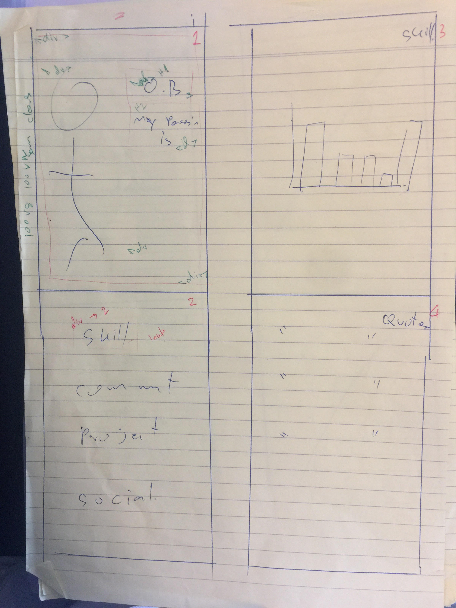

\

Welcome my Website O.B. Pumanee

GitHub repository. 

https://github.com/obpumanee

portfolio website.

https://obpumanee.github.io/

Contents
1. About this Profile
2. Design Process
3. Planning Process
4. Q & A

About this Profile

Purpose
The purpose of this web profile was to create and design a website using the current of technology like HTML, CSS and JavaScript 

Design
The Design is aming to connect between user and portfolio person for contact and communication online. 

Functionality and Features
The functionality in this website is presenting useful information for portfolio person, detail, project, skill, contacting. Therefore they can update all the information and have a link to other information online. 

Going with the design is clean look and easy to use for the user. 

My site map

Screenshots
Desktop Version and mobile  

Target Audience
My Target audience for this portfolio is for potential future clients and employers who would like to see my designs in a quick and simple effective way without much padding.

Tech Stack
For this online portfolio project, I used HTML, CSS and Javescript.

Design Process

start with moblie size and increse to desktop size.

use google front 

Usability Considerations
**
For usability considerations, I made sure to give my non text links the ability to say what they are and where they lead to for everyone, particularly to those who are vision impaired.

Screenshots of Trello Board for Project Planning

Q&A

1. Describe key events in the development of the internet from the 1980s to today (max. 150 words)

The Key events for the development of the internet from 1980s is for connecting computer to computer by cables technologies(wireless is also use to connect to the internet in now)
However, it has become the everyday life of people. Thank for the advancement of web software and technology now make it faster and more useful than ever before. Such as facebook, google, fibre optic cable and etc. 

2. Define and describes the relationship between fundamental aspects of the internet such as: domains, web servers, DNS, and web browsers (max. 150 words)

Domains are the tools using characters and its converts from IP address to provide the required webpage.
Web servers on the other hand consist of all the data on the internet. It is a system that creates and provides webpages for people to search.

A web browser is computing software which helps in searching for information, pinpointing its exact location and displaying the webpage back to the user.

3. Reflect on one aspect of the development of internet technologies and how it has contributed to the world today (max. 150 words)

Easy, fast and freedom to excess the information. life has become increasingly more efficient and easier to navigate around. Now more and more people on the internet and connect to each other than ever. More people connect and access to the information around the globe more technology, freedom and right of people will become.   